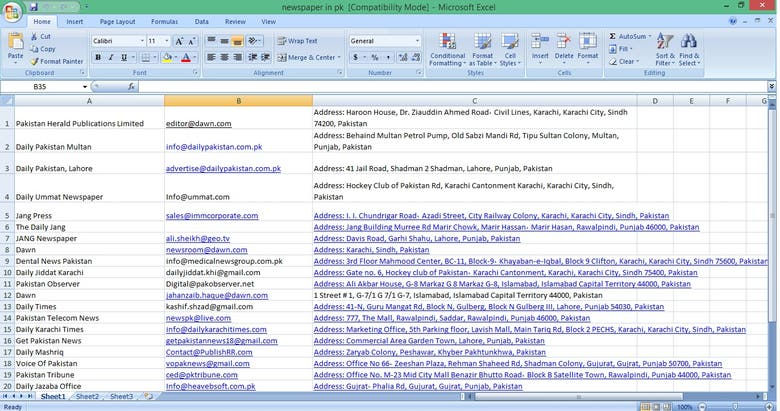

<!DOCTYPE html>
<html lang="en">
<head>
  <meta charset="UTF-8" />
  <meta name="viewport" content="width=device-width, initial-scale=1.0" />
  <title>Md. Harun Or Rashid</title>
  <link rel="stylesheet" href="style.css" />
  
</head>
<body>

<header>
  Md. Harun Or Rashid
  <button class="menu-button" onclick="toggleMenu()">&#8942;</button>
</header>

<!-- Dropdown Menu -->

  <a href="#" onclick="showSection('profile')">Profile</a>
  <a href="#" onclick="showSection('privacy')">Privacy Policy</a>
  <a href="#" onclick="showSection('contact')">Contact</a>
  <a href="#" onclick="showSection('about')">About</a>
  <a href="#" onclick="showSection('settings')">Settings</a>

<!-- Tab Navigation -->
<nav class="tab-bar">
  <a href="index.html" class="tab">Home</a>
  <a href="about.html" class="tab">About</a>
  <a href="contact.html" class="tab">Contact</a>
  <a href="services.html" class="tab">Services</a>
  <a href="portfolio.html" class="tab">Portfolio</a>
</nav>

<!-- Search Section -->

  <h2>Search My Website</h2>
  

<!-- Profile Section -->

  <h2>My Profile</h2>
  
  
<strong>Name:</strong> Md. Harun Or Rashid

  
<strong>Address:</strong> Manikganj, Dhaka, Bangladesh

  
<strong>Email:</strong> hmharun796@gmail.com

  
<strong>Education:</strong> SSC, Lemubari Binoda Sundori High School

  
<strong>Profession:</strong> Freelancer

  
<strong>Skills:</strong> Data Entry, E-commEntry, Web Research, Data Research, Web Scraping, Data Scraping, Copy-Paste, and more.

  
<strong>Phone:</strong> +8801648131500

  
<strong>Phone:</strong> +8801316888404

<!-- Privacy Policy -->

  <h2>Privacy Policy</h2>
  
We do not share your personal information.

<!-- Contact Section -->

  <h2>Contact</h2>
  
Email: hmharun796@gmail.com

  <a class="button fiverr" href="https://www.fiverr.com/s/dDlW3G3" target="_blank">Visit My Fiverr Profile</a>
  <a class="button" href="https://www.facebook.com/share/r/1BcEg68nzy/" target="_blank">Visit My Facebook</a>
  <a class="button" href="https://www.instagram.com/p/DIeAfFXT_oO/" target="_blank">View My Instagram</a>
  <a class="button" href="https://www.tiktok.com/@user6071584366187" target="_blank">TikTok</a>
  <a class="button" href="https://wa.me/8801648131500?text=Hi,%20I%20want%20to%20contact%20you" target="_blank">WhatsApp</a>

<!-- About Section -->

  <h2>About</h2>
  
We do not share your personal information.

  
<strong>Profession:</strong> Freelancer

  
<strong>Skills:</strong> Data Entry, E-commEntry, Web Research, Data Research, Web Scraping, Data Scraping, Copy-Paste, and more.

<!-- Settings Section -->

  <h2>Settings</h2>
  
Settings coming soon.

<!-- Order Buttons -->

  <a href="mailto:hmharun123@gmail.com?subject=Hiring Request&body=Hello, I would like to hire you for a project." target="_blank">
    <button style="background-color: #4CAF50; color: white; padding: 12px 24px; border: none; border-radius: 8px; font-size: 16px; cursor: pointer;">Order Now</button>
  </a>
  <a href="https://wa.me/8801795815184?text=Hi%20Harun,%20I%20am%20interested%20in%20your%20services." target="_blank">
    <button style="background-color: #25D366; color: white; padding: 12px 24px; border: none; border-radius: 8px; font-size: 16px; cursor: pointer;">Order on WhatsApp</button>
  </a>

<!-- Certificate Section -->

  <h2>Certificate of Completion</h2>
  
  

</body>
</html>
  </style>
   <a href="mailto:hmharun123@gmail.com?subject=Hiring Request&body=Hello, I would like to hire you for a project." target="_blank">
    <button class="button">Order Now</button>
  </a>
  <a href="https://wa.me/8801795815184?text=Hi%20Harun,%20I%20am%20interested%20in%20your%20services." target="_blank">
    <button class="button" style="background-color: #25D366;">Order on WhatsApp</button>
  </a>

  

    <a class="button fiverr" href="https://www.fiverr.com/s/dDlW3G3" target="_blank">Visit My Fiverr Profile</a>
    <a class="button" href="https://www.facebook.com/share/r/1BcEg68nzy/" target="_blank">Visit My Facebook</a>
    <a class="button" href="https://www.instagram.com/p/DIeAfFXT_oO/" target="_blank">View My Instagram</a>
    <a class="button" href="https://www.tiktok.com/@user6071584366187" target="_blank">TikTok</a>
    <a class="button" href="https://wa.me/8801648131500?text=Hi,%20I%20want%20to%20contact%20you" target="_blank">WhatsApp</a>
  

  <h2>About</h2>
  
I am a freelancer specialized in data entry and online tasks.

  <h2>Settings</h2>
  
Settings coming soon.

  <h2>Payoneer Account Creation Tutorial</h2>
 mdha39003@gmail  <iframe width="560" height="315" src="https://www.youtube.com/embed/bWgg3zyC8PQ" title="Payoneer Account Creation Tutorial" frameborder="0" allowfullscreen></iframe>

  <h2>My Photo & Video</h2>
  
  <video controls width="400">
    <source src="media/Ami_Soia_Geleo_Soibena_Bidhata.mp4" type="video/mp4">
    Your browser does not support the video tag.
  </video>

  
  
  
  
  
  

  <h2>My Gallery</h2>
  

    
    
    
    
  

  <h2>My YouTube Channel</h2>
  
Subscribe to my channel for tutorials, tips, and more!

  <a class="button" href="https://youtube.com/@mdharun-n6j" target="_blank">Visit My YouTube</a>

  <h2>My Portfolio</h2>
  
Here are some examples of the data entry work I've done:

  

    <a class="button" href="https://docs.google.com/spreadsheets/d/1FSV3CzDlRSDJHaumYrCcvKFcBKGedUhFU9qPDY6viW4/edit?usp=drivesdk" target="_blank">Sample Data Entry Work</a>
    <a class="button" href="https://drive.google.com/file/d/1xA2EXAMPLE123/view" target="_blank">Product Listing (Excel)</a>
    <a class="button" href="https://drive.google.com/file/d/1yB3EXAMPLE456/view" target="_blank">Web Research Sample</a>
    <a class="button" href="https://drive.google.com/file/d/1zC4EXAMPLE789/view" target="_blank">PDF to Excel Conversion</a>
  

<button id="backToTop" onclick="scrollToTop()">↑</button>

</body>
</html>
